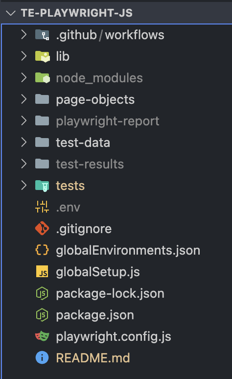
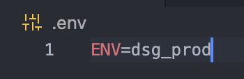

# te-playwright-ts

Playwright test automation framework for ecomm websites using typescript

## Install and Setup Steps

### If Node and/or Git are not installed, follow the steps below:

Node - If using a mac, install from Self Service  
Git - If using a mac, install Homebrew from Self Service and run the following cmd:

    brew install git

### After cloning the repo, use the following command to install dependencies:

    npm ci

### Run a test as a test

Run the following cmd:

    npm test

This will run 2 secured athlete login tests on the dsg prod site since that is the default when no environment is set. Set an environment next.

### Create .env file at the project root:

    ~/.env

### Setting Test Environment

Environment can be set in the command line or .env file.  Environments can be found in ~/globalEnvironments.json file.

### Run two more tests

Set ENV=gg_prod in the .env file like the image above and run the folowing cmd:

    npm test

This will run 2 secured athlete login tests on the golf galaxy prod site this time.

Run the test one more time after setting the environment in the cmd line:

    ENV=pl_prod npm test

This will run the same tests on the public lands prod site.

### Documentation for running other tests:

    https://playwright.dev/docs/running-tests
