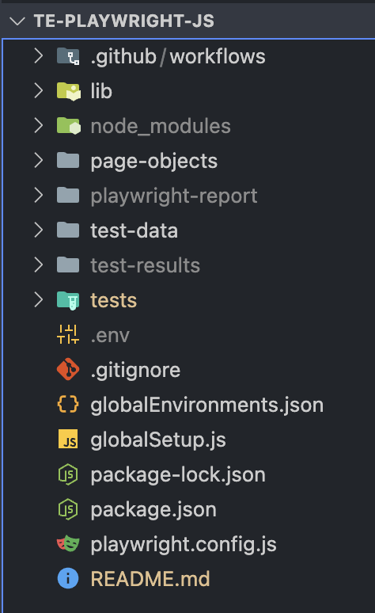

# te-playwright-js

# Install Steps

After cloning the repo, use the following command to install dependencies:

    npm ci

Create .env file at the project root:

    te-playwright-js/.env

Setting Test Environment

    Environment can be set in the command line or .env file.  If no environment is set, it will default to dsg_prod.
    Environments can be found in te-playwright-js/globalEnvironments.json file.
        Example: ENV=dsg_prod

Documentation for running tests:

    https://playwright.dev/docs/running-tests
