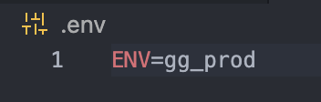

# te-playwright-ts

Playwright test automation framework for ecomm websites using typescript

## Install and Setup Steps

### If Node and/or Git are not installed, follow the steps below:

Node - If using a mac, install from Self Service  
Git - If using a mac, install Homebrew from Self Service and run the following cmd:

    brew install git

### After cloning the repo, use the following command to install dependencies:

    npm ci

### Run a test as a test

Run the following cmd:

    npm test

This will run 2 secured athlete login tests on the dsg prod site since that is the default when no environment is set. Set an environment next.

### Create .env file at the project root:

    ~/.env

### Setting Test Environment

Environment can be set in the command line or .env file.  Environments can be found in ~/globalEnvironments.json file.

### Run two more tests

Set ENV=gg_prod in the .env file like the image above and run the folowing cmd:

    npm test

This will run 2 secured athlete login tests on the golf galaxy prod site this time.

Run the test one more time after setting the environment in the cmd line:

    ENV=pl_prod npm test

This will run the same tests on the public lands prod site.

### Documentation for running other tests:

    npx playwright test <test-file-path>: Run the specified spec file
    npx playwright test --grep @tag: Run tests tagged with the specified tag
    npx playwright test -g '<testName>': run the specified test name

    adding --headed to any commands above will run in headed mode

    https://playwright.dev/docs/running-tests

# Playwright Standards using ESLint

* Always run ‘npm ci’ on the command line to install current dependencies
* The goal is to resolve all errors and warning from ESLint before creating a PR
* ESLint is not currently part of commits/pushes/PR’s but will be in the future
* Link to ESLint for typescript: https://typescript-eslint.io/getting-started
* Link to ESLint Playwright Plugin: https://github.com/playwright-community/eslint-plugin-playwright
* Link to ESLint Stylistic Plugin: https://eslint.style/guide/getting-started

* Bonus: You can install the ESLint extension in VSCode and it will show you errors and warning in real time!

## Formatting:

* Use the VSCode built in formatter prior to committing and pushing code
    * Right click inside the file and choose ‘Format Document’ then Save
* ESLint will do some formatting for spaces and quotes but not everything

## Linting:

* ESLint has been installed.
* You can run the linter using the following commands and including the file or directory
* Examples:
    * npx eslint ./tests/checkout
        * This will run against all the files int he checkout directory
    * npx eslint ./page-objects/CartPage.ts
        * This will run against CartPage.ts file only
* Many errors or warnings can be resolved automatically using the linter by using the following commands:
    * npx eslint ./tests/checkout —fix
    * npx eslint ./page-objects/CartPage.ts —fix

## Waits:

* No Sleeps - unless absolutely necessary
    * If a sleep is necessary, add a comment to the code describing the reason
* No page.waitForTimeout()
    * If a waitForTimeout() is necessary, add a comment to the code describing the reason
* Use Locator actions and web assertions that wait automatically
    * Example which waits for the last product to load in PLP: await productListingPage.productNames.last().waitFor();
* May also try using:
    * page.waitForLoadState('domcontentloaded')
    * page.waitForLoadState('load');
* Last resort but use sparingly because it slows down tests substantially:
    * page.waitForLoadState(’networkidle)

## Assertions:

* Expect library is preferred
* https://playwright.dev/docs/test-assertions
* Example: 
    * Use this: await expect(this.forgotPasswordHeader).toBeVisible();
    * Not this: await this.forgotPasswordHeader.isVisible();

## Try/Catch:

* Avoid unless necessary
* Using an ‘if’ statement would work for the example below
* These will get picked up by the linter if the error (e) is not used in the catch
* Skip these with line disable comment
    * // eslint-disable-line

## eslint-disable-line

* If code is being picked up by the linter but it is valid and you do not want it to change, you can add a disable line comment so it will not be picked up
    * Add ‘// eslint-disable-line’ to the code on the line

In this example, the linter does not like using ‘let’ instead of ‘const’ since index is never reassigned.  However, trendingSearch is reassigned so ‘let’ is necessary.

## Tagging and Filename conventions

*With PLP as an example below, provide similar tagging and filenaming conventions within your .ts files

Sample Tags:  @PLP, @Smoke, @Regression, Env(@Prod, @Preview, @np0Prod, @All), Brand(@DSG, @GG, @All)
Spec Files :
PLP_QuickView
PLP_Search
PLP_Favorites
PLP_Smoke