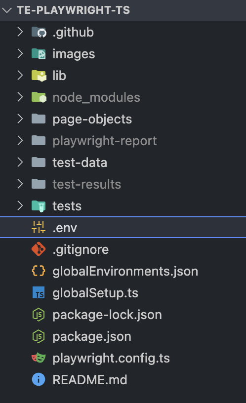

# te-playwright-js

Playwright test automation framework for ecomm websites

## Install and Setup Steps

### After cloning the repo, use the following command to install dependencies:

    npm ci

### Create .env file at the project root:

    te-playwright-ts/.env

### Setting Test Environment

Environment can be set in the command line or .env file.  If no environment is set, it will default to dsg_prod. Environments can be found in te-playwright-ts/globalEnvironments.json file.

### Documentation for running tests:

    https://playwright.dev/docs/running-tests
